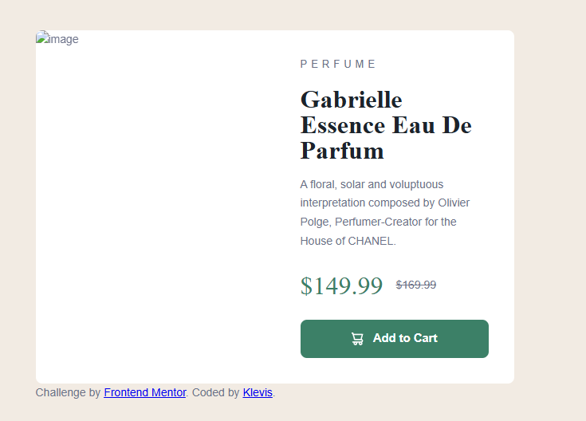

🛍 Product Preview Card

A responsive Product Preview Card built as part of a Frontend Mentor challenge.
The project focuses on building a clean product UI component with responsive layout, pricing details, and interactive button styling.

🚀 Features

- Responsive product card layout
- Product image and category label
- Product description
- Pricing display with discount and original price
- “Add to Cart” button
- Clean modern UI design

| Technology       | Purpose                 |
| ---------------- | ----------------------- |
| **HTML5**        | Semantic page structure |
| **CSS3**         | Styling and layout      |
| **Flexbox**      | Layout alignment        |
| **GitHub Pages** | Deployment              |

📸Screenshot

